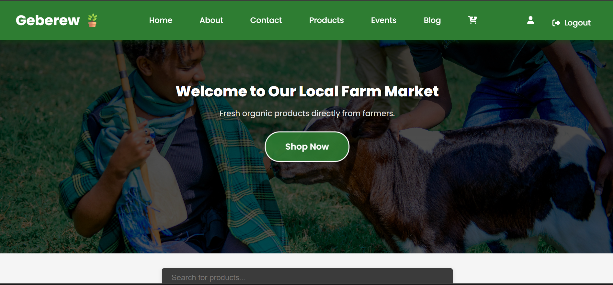
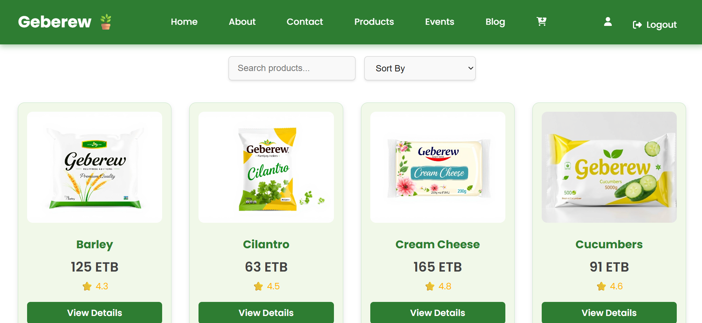
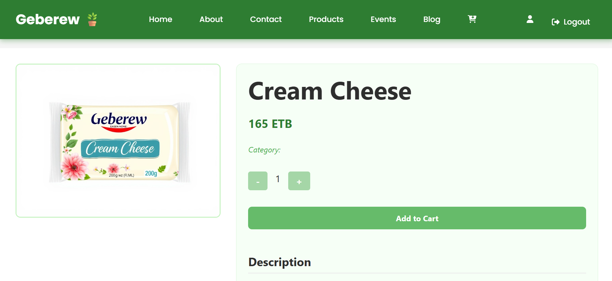
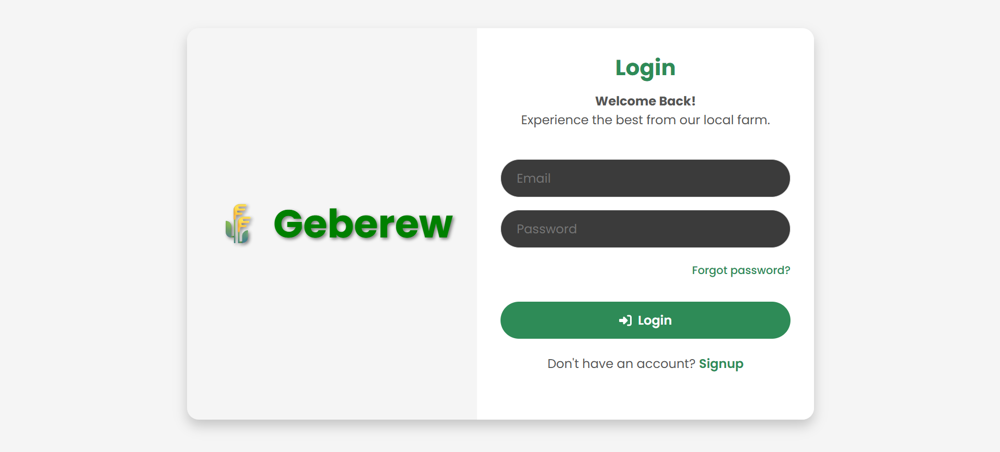

🛒 Local Farm Market eCommerce Platform

A full-stack eCommerce platform designed to support local farm markets. Customers can browse and purchase products online, while administrators manage products, users, and customer interactions. The system implements secure authentication, role-based access, and responsive design.

---

🚀 Live Demo

🔗 (Add your deployed link here)

---

📌 Overview

This platform streamlines the process of buying and managing farm products online. It supports multiple user roles, allowing admins to manage inventory and users, while customers can explore products, leave reviews, and interact with the marketplace. The project was developed collaboratively with a focus on backend architecture and API integration.

---

✨ Key Features

* Role-based access control: Admin and Customer accounts
* Product management: Browse, search, and view products
* User management: Registration, login, profile management
* Admin dashboard: Manage products and users
* Customer review system for products
* Responsive UI designed with Tailwind CSS
* Secure backend with JWT authentication and role-based permissions

---

👨‍💻 My Contribution (Backend Developer)

* Developed RESTful APIs for products, users, and authentication
* Implemented JWT-based authentication and role-based authorization
* Designed database models and integrated MongoDB with backend services
* Connected backend APIs with React frontend for full-stack functionality

---

🛠 Tech Stack

* Frontend: React.js, Tailwind CSS, Axios, React Router
* Backend: Node.js, Express.js, MongoDB, Mongoose, Multer
* Authentication: JSON Web Token (JWT)
* Deployment: Currently running locally (free deployment coming soon)

---

📁 Project Structure

```bash id="xg3h7l"
local-farm-ecommerce/
├── LocalFarmMarket-frontend/  # React frontend
├── LocalFarmMarket-backend/   # Node.js backend
└── README.md
```

---

📸 Screenshots

🏠 Homepage


Product List


📖 Product Detail


Loginpage


---

💻 How to Run Locally

1. Clone the repository

```bash
git clone https://github.com/yourusername/local-farm-ecommerce.git
cd local-farm-ecommerce
```

2. Install dependencies

```bash
# Frontend
cd LocalFarmMarket-frontend
npm install

# Backend
cd ../LocalFarmMarket-backend
npm install
```

3. Set up environment variables (backend `.env`):

```bash
PORT=5000
MONGO_URI=your_mongodb_connection_string
JWT_SECRET=your_jwt_secret_key
```

4. Start the application
   From project root (using concurrently):

```bash
npm run dev
```

---

🚧 Future Enhancements

* Payment gateway integration (Stripe/Chapa)
* Order processing and delivery tracking
* Mobile PWA version for offline use
* Role management and audit logging
* Multi-language support


